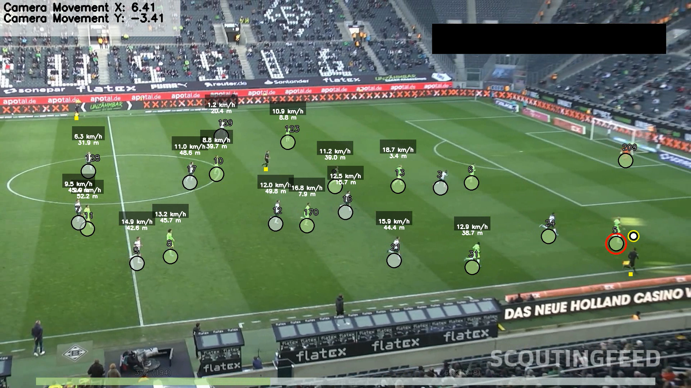

# ⚽ Football Analysis with Computer Vision  

  

> A complete end-to-end football (soccer) analysis pipeline built using **YOLO-based tracking**, **camera motion compensation**, **homography transformations**, and **player speed/distance estimation**.  

This project takes raw broadcast video as input and outputs an **annotated video** with:  
- Player & ball tracking  
- Team assignment  
- Ball possession  
- Player speed (km/h) & distance (meters)  
- Camera movement visualization  

---

## 🚀 Features  

✅ **Object Tracking** – Players, ball, and referees tracked using YOLO + SORT/ByteTrack.  
✅ **Camera Motion Compensation** – Adjusts for panning/zooming cameras to keep positions consistent.  
✅ **View Transformation (Homography)** – Converts pixel coordinates to real-world field coordinates (105 × 68 m).  
✅ **Player Speed & Distance Estimation** – Calculates realistic sprint speeds and distances covered.  
✅ **Team Assignment** – Classifies players into two teams based on jersey color.  

---

## 📂 Project Structure  

```
.
├── config.py                # Configuration (paths, model, constants)
├── main.py                  # Main entry point
├── trackers/                # Object tracking (players, ball, referees)
├── camera_movement_estimator.py  
├── view_transformer.py      # Homography transformation (pixel → meters)
├── speed_distance_estimator.py  
├── team_assigner.py         
├── player_ball_assigner.py  
├── utils.py                 # Helper functions (video I/O, distance, etc.)
├── images/                  # Project images & figures
│   └── img.png
└── README.md
```

---

## ⚙️ Installation  

1. Clone the repository:  
```bash
git clone https://github.com/yourusername/football_analysis.git
cd football_analysis
```

2. Install dependencies:  
```bash
pip install -r requirements.txt
```

3. Download YOLO model weights and place them in `models/` (update `config.py` with the correct path).  

---

## ▶️ Usage  

Run the pipeline:  
```bash
python main.py
```  

Input video: `input_videos/match.mp4`  
Output video: `output_videos/match_annotated.mp4`  

---

## 📊 Output Annotations  

- Player IDs, team colors, and possession info  
- Player speed (km/h) and distance covered (m)  
- Ball position and assignment to players  
- Camera motion overlay  

---

## 🛠️ Future Improvements  

- [ ] Better Goalkeeper to team assigment ( Temporarily hard coded untill fix )
- [ ] Improve homography calibration (automatic line detection)  
- [ ] Add pass & event detection (e.g., shots, tackles)  
- [ ] Integrate real match stats export (CSV/JSON)  


